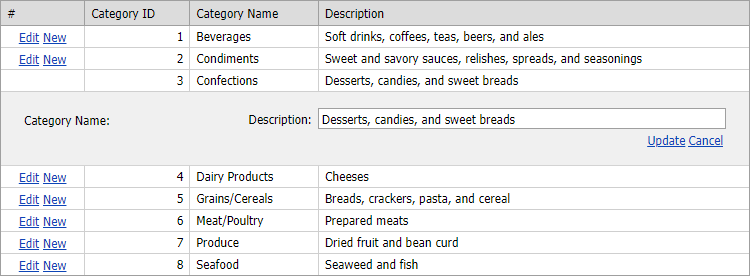

<!-- default badges list -->

[](https://supportcenter.devexpress.com/ticket/details/E256)
[](https://docs.devexpress.com/GeneralInformation/403183)
[](#does-this-example-address-your-development-requirementsobjectives)
<!-- default badges end -->

# GridView for ASP.NET Web Forms - How to hide an edit form editor based on a column value

This example demonstrates how to hide an editor from the edit form dynamically.



Use the `e.Editor.Visible` property in the [CellEditorInitialize](https://docs.devexpress.com/AspNet/DevExpress.Web.ASPxGridView.CellEditorInitialize) event handler to control an editor's visibility.

```
protected void grid_CellEditorInitialize(object sender, ASPxGridViewEditorEventArgs e) {
    ASPxGridView gridView = (ASPxGridView)sender;

    if (!gridView.IsNewRowEditing) {
        Int32 keyValue = (Int32)gridView.GetRowValues(gridView.EditingRowVisibleIndex, new String[] { gridView.KeyFieldName });

        if (e.Column.FieldName == "CategoryName")
            e.Editor.Visible = (keyValue % 2 == 0);
    }
}
```

## Files to Review

* [Default.aspx](./CS/WebSite/Default.aspx) (VB: [Default.aspx](./VB/WebSite/Default.aspx))
* [Default.aspx.cs](./CS/WebSite/Default.aspx.cs) (VB: [Default.aspx.vb](./VB/WebSite/Default.aspx.vb))

## More Examples
* [Grid View for ASP.NET Web Forms - How to hide the EditForm editor and column caption programmatically](https://github.com/DevExpress-Examples/asp-net-web-forms-grid-hide-edit-form-editor-programmatically)
<!-- feedback -->
## Does this example address your development requirements/objectives?

[](https://www.devexpress.com/support/examples/survey.xml?utm_source=github&utm_campaign=asp-net-web-forms-grid-hide-editform-editor-based-dynamically&~~~was_helpful=yes) [](https://www.devexpress.com/support/examples/survey.xml?utm_source=github&utm_campaign=asp-net-web-forms-grid-hide-editform-editor-based-dynamically&~~~was_helpful=no)

(you will be redirected to DevExpress.com to submit your response)
<!-- feedback end -->
